<div align="center">

# 🔐 AuthX

**A production-style authentication & authorization platform: JWT, OAuth2, MFA, RBAC, multi-tenant organizations and risk-based login protection.**


[**Live Demo**](https://java-spring-security.vercel.app/) · [**API Docs (Swagger)**](https://authx-backend-9atg.onrender.com/swagger-ui/index.html) · [**Report a Bug**](https://github.com/Mtaijim/Authx/issues)
## 🎥 Project Demo

[▶️ Watch AuthX Demo video](https://x.com/Mtaijim_/status/2104662313127276877/video/1)

</div>

---

## Table of Contents

1. [Overview](#1-overview)
2. [Screenshots](#2-screenshots)
3. [Feature Deep Dive](#3-feature-deep-dive)
4. [Tech Stack](#4-tech-stack)
5. [Architecture](#5-architecture)
6. [Core Flows](#6-core-flows)
7. [Data Model](#7-data-model)
8. [Security Model](#8-security-model)
9. [Authorization (RBAC)](#9-authorization-rbac)
10. [Engineering Decisions](#10-engineering-decisions)
11. [API Reference](#11-api-reference)
12. [Error Handling](#12-error-handling)
13. [Project Structure](#13-project-structure)
14. [Getting Started](#14-getting-started)
15. [Configuration Reference](#15-configuration-reference)
16. [Deployment](#16-deployment)
17. [Production Hardening Checklist](#17-production-hardening-checklist)
18. [Troubleshooting](#18-troubleshooting)
19. [Known Limitations](#19-known-limitations)
20. [Testing](#20-testing)
21. [Roadmap](#21-roadmap)
22. [Author](#22-author)

---

## 1. Overview

AuthX is a full-stack identity platform that can sit behind any application. It goes beyond "login with email and password" and implements what real products need: social sign-in, multi-factor authentication, fine-grained permissions, organization workspaces, brute-force protection, risk-aware logins and a complete audit trail.

- **Backend:** Spring Boot REST API, stateless JWT auth, MySQL persistence.
- **Frontend:** React + TypeScript single-page app with dedicated screens for identity, security operations and administration.
- **Deployment:** Dockerized backend on Render, frontend on Vercel, managed MySQL.

> ⚠️ The demo runs on free-tier hosting, so the first request after idle time may take ~30–60 seconds while the backend wakes up.

---

## 2. Screenshots


| Sign in | MFA setup |
|---|---|
| 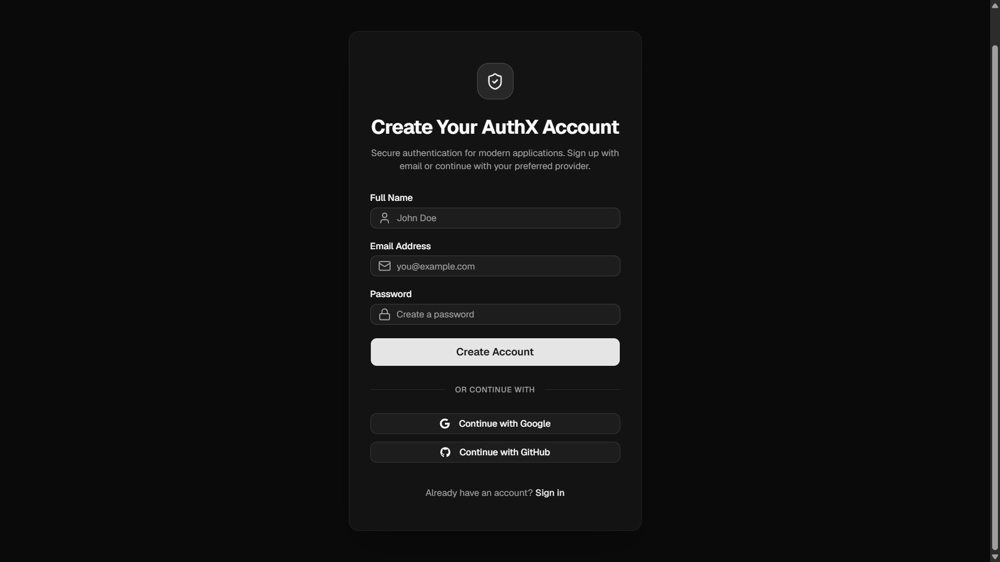 | 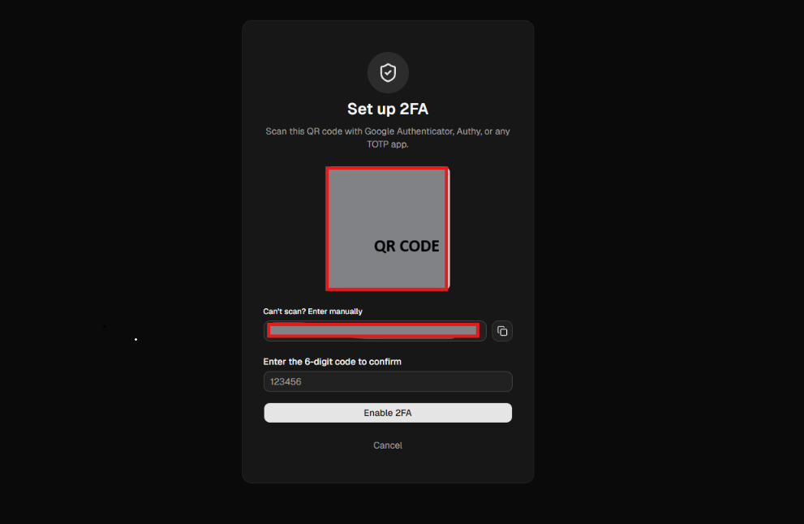 |

| Admin dashboard | Audit log viewer |
|---|---|
| 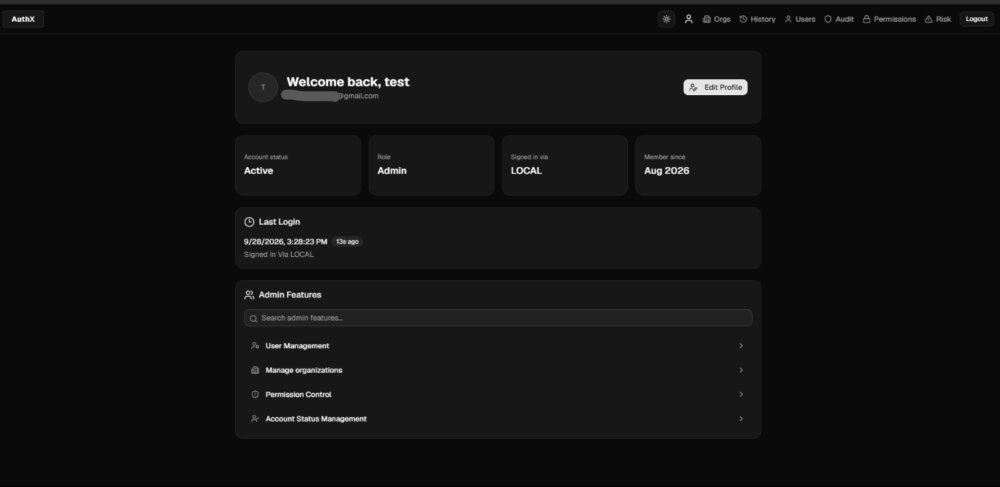 |  |

| Organizations | Risk dashboard |
|---|---|
|  | 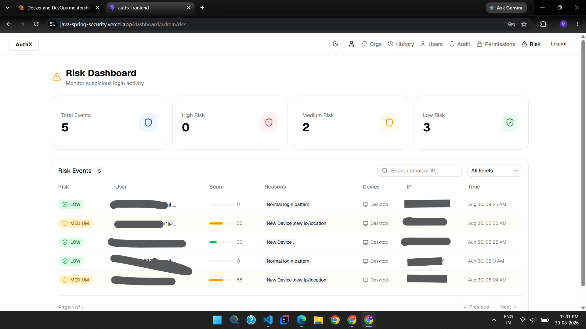 |

---

## 3. Feature Deep Dive

### Account lifecycle
| Capability | Details |
|---|---|
| Registration | Email is validated by format, a **disposable-domain blocklist** and a live **MX-record lookup**. Passwords are BCrypt-hashed. New accounts start **disabled** until the email is verified. |
| Email verification | UUID token, valid **24 hours**, single use. |
| Forgot / reset password | Token valid **15 minutes**, single use. The forgot-password endpoint stays silent when the email doesn't exist (no account enumeration). |
| Password history | The last **5** password hashes are stored; reuse is rejected on reset. |
| Social login | Google and GitHub via OAuth2. The user is found by email or created on first login. |

### Sessions & tokens
| Token | Lifetime | Where it lives |
|---|---|---|
| Access token (JWT, HS512) | `JWT_ACCESS_TTL_SECONDS` | Returned in the response body, sent as `Authorization: Bearer` |
| Refresh token (JWT, HS512) | `JWT_REFRESH_TTL_SECONDS` | **httpOnly** cookie, tracked server-side by `jti` |
| MFA token | 5 minutes | Response body; only valid for the MFA challenge endpoints |
| Blacklist | until token expiry | `blacklisted_tokens` table, cleaned daily by a scheduled job |

### Multi-factor authentication
- **TOTP** (SHA-1, 6 digits, 30-second step, ±1 step tolerance) compatible with Google Authenticator, Authy, 1Password, etc.
- QR code generated server-side as a data URI.
- **10 backup codes** in `XXXX-XXXX` format, BCrypt-hashed at rest, single use, regenerable with a valid TOTP code.

### Abuse protection
| Layer | Rule |
|---|---|
| IP rate limit | `POST /api/v1/auth/login`: **5 attempts / 15 min per IP** (Bucket4j token bucket, held in an in-memory `ConcurrentHashMap` keyed by IP) → `429` |
| Account lockout | **5 consecutive failures** → locked for **15 minutes**, alert email sent |
| Risk scoring | See below |
| Suspicious-login alert | Async email when the device or IP wasn't seen in the last 10 successful logins |

### Risk-based login scoring

Each login is scored 0–100 by `RiskScoringService`:

| Signal | Points |
|---|---|
| Unrecognized device (user-agent) | +30 |
| Unrecognized IP | +25 |
| More than 3 failed logins in the last 15 minutes | +20 |
| Login between 00:00 and 05:00 | +15 |

Levels: **LOW** ≤ 30 · **MEDIUM** ≤ 60 · **HIGH** > 60. Risky logins can require an emailed OTP (`RiskVerificationToken`) before tokens are issued. Every score is stored and viewable per user and by admins.

### Organizations (multi-tenancy)
- Create an organization (creator becomes `OWNER`); slug auto-generated from the name.
- Invite by email → membership starts `PENDING` → invitee **accepts** (`ACTIVE`) or **declines** (`DECLINED`).
- Org roles: `OWNER`, `ADMIN`, `MEMBER`, `VIEWER`, independent of global roles.
- Org-scoped audit log visible to org `OWNER` / `ADMIN` only.

### Observability
- **Audit log:** who, what, when, IP, user-agent, resource, success/failure, optionally scoped to an org.
- **Login history:** last 20 events per user with device, OS, IP and failure reason.
- **Swagger UI** for the full API.

---

## 4. Tech Stack

| Layer | Technology |
|---|---|
| Backend | Java, Spring Boot, Spring Security, Spring Data JPA (Hibernate) |
| Database | MySQL |
| Auth | JWT (`jjwt`, HS512), Spring OAuth2 Client, TOTP (`samstevens.totp`) |
| Rate limiting | Bucket4j (buckets in a `ConcurrentHashMap`) |
| Email | Brevo transactional email HTTP API via `RestClient` |
| Mapping | ModelMapper |
| API docs | springdoc-openapi |
| Frontend | React, TypeScript |
| Containerization | Docker |
| Hosting | Render (backend), Vercel (frontend) |

---

## 5. Architecture

### System overview


### Backend request flow


Requests traverse `RateLimitFilter` → `JwtAuthenticationFilter` → Spring Security authorization → controller → service → repository → MySQL. Email goes out through the Brevo API from the service layer; OAuth2 login is handled by Spring's OAuth2 filters plus a custom success handler.

### Frontend structure

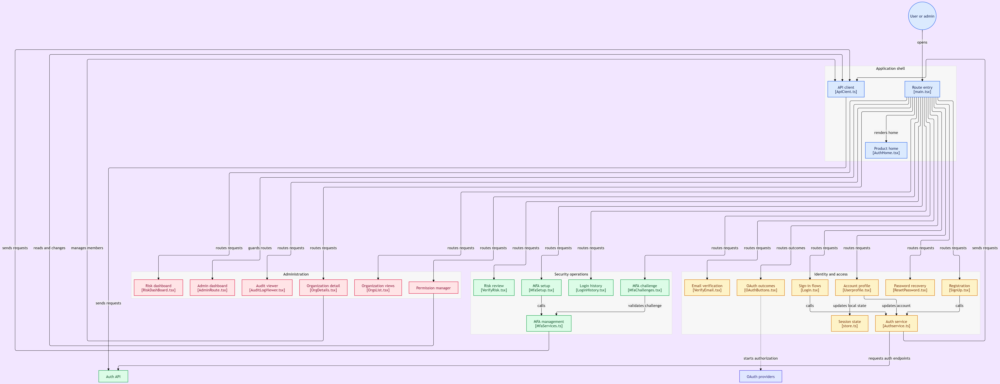

The SPA is organized into an **application shell** (routing, API client), **Identity & Access** (sign in, sign up, password recovery, OAuth, profile), **Security operations** (MFA setup/challenge, login history, risk review) and **Administration** (admin dashboard, audit viewer, organizations, permissions, risk dashboard).

---

## 6. Core Flows

### 6.1 Registration and email verification

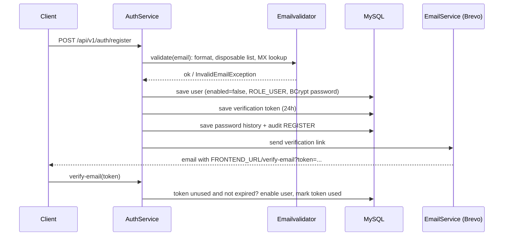

### 6.2 Login (rate limit, lockout, risk, MFA)

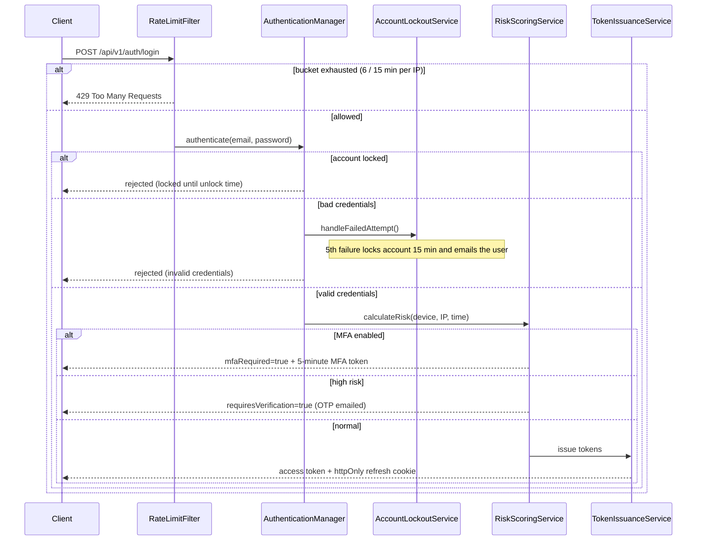

### 6.3 MFA setup and challenge

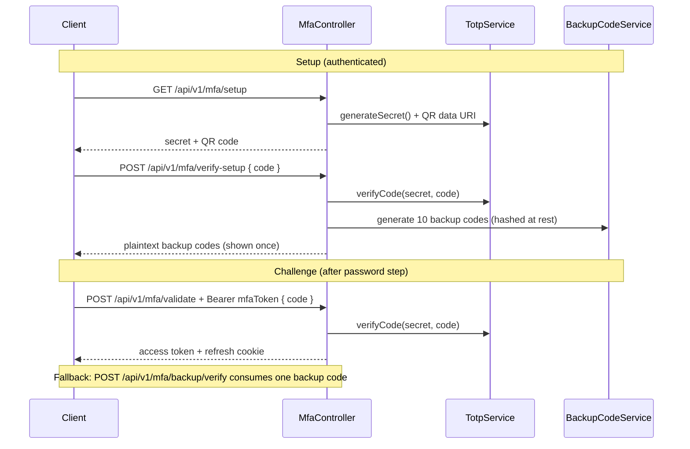

### 6.4 OAuth2 login (Google / GitHub)

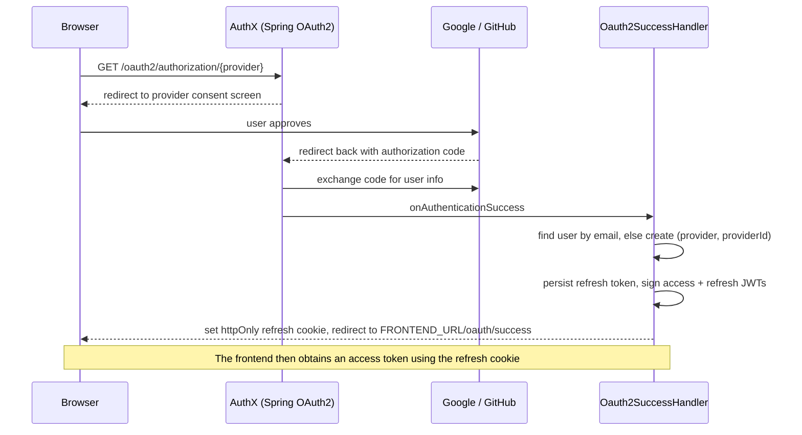

### 6.5 Forgot / reset password

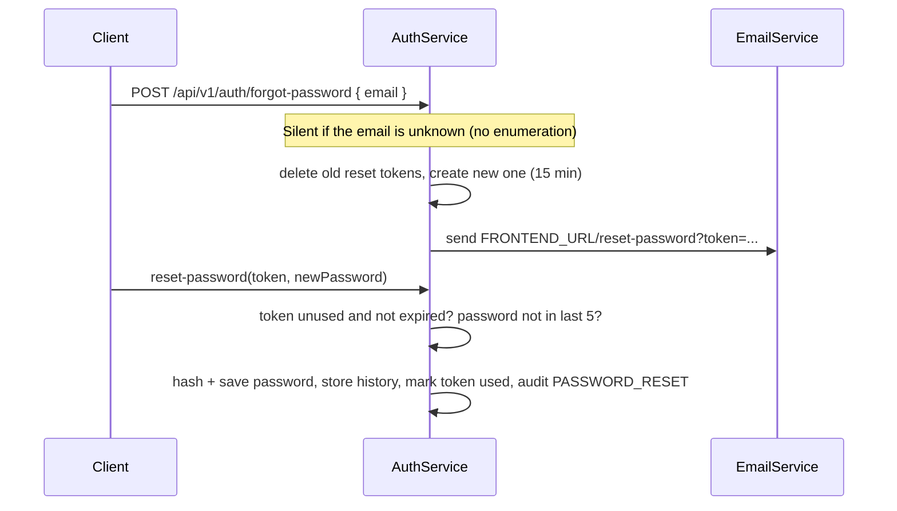

### 6.6 Organization invite

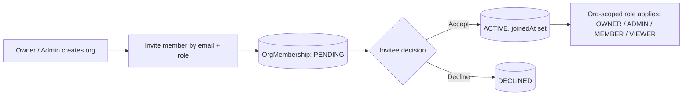

---

## 7. Data Model

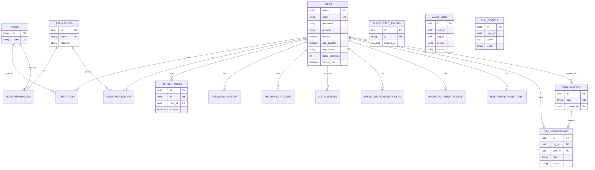

Notes:
- `audit_logs` and `risk_scores` reference users by plain `UUID` column, not a foreign key, so history survives user deletion.
- `blacklisted_tokens` is independent by design (lookup by `jti` on every request, indexed).
- Hibernate stores `UUID` as `BINARY(16)` on MySQL. When querying manually use `BIN_TO_UUID(user_id)` / `UUID_TO_BIN(...)`.
- Schema is managed by Hibernate (`ddl-auto: update`).

---

## 8. Security Model

| Threat | Mitigation |
|---|---|
| Password theft from DB | BCrypt hashing for passwords and MFA backup codes |
| Brute force / credential stuffing | Per-IP token bucket on login + per-account lockout + alert email |
| Stolen refresh token via XSS | httpOnly cookie; server-side `jti` tracking |
| Reuse of leaked access token after logout | `jti` blacklist checked on every request |
| Account enumeration | Forgot-password responds identically for unknown emails; login errors are generic |
| Reused / weak recycled passwords | Last-5 password history check |
| Fake or throwaway signups | Disposable-domain blocklist + MX lookup |
| Login from unfamiliar device or place | Risk scoring, OTP step-up, suspicious-login email |
| Privilege escalation | Role + permission checks via `@PreAuthorize` and request matchers; self-service limited by `@userSecurity.isSelf` |
| Cross-origin abuse | CORS restricted to `FRONTEND_URL` origins; credentials allowed only for them |
| Tampered tokens | HS512 signature with a ≥64-character secret; token *type* claim (`access` / `refresh` / `mfa`) checked so tokens can't be swapped |

Additional details:
- JWT secret shorter than 64 characters makes the app **fail at startup** by design.
- CSRF protection is disabled because the API is stateless and authenticated via `Authorization` headers.
- Every sensitive action writes an audit log entry, including failures.

---

## 9. Authorization (RBAC)

Authorities for a user are the union of three sources:

```
authorities(user) =
    { role.name                    for each role of the user }        e.g. ROLE_ADMIN
  ∪ { permission.name              for each permission of those roles }
  ∪ { permission.name              for each permission granted directly to the user }
```

**Roles:** `ROLE_USER` (default on registration), `ROLE_ADMIN` (seeded with every permission).

**Seeded permissions**

| Category | Permissions |
|---|---|
| users | `users_view`, `users_edit`, `users_delete`, `users_ban` |
| reports | `reports_view`, `reports_export` |
| billing | `billing_view`, `billing_manage` |
| audit | `audit_view` |
| settings | `settings_view`, `settings_manage` |

Admins can create more permissions and assign or revoke them per user at runtime.

**Two independent scopes**
- **Global** access (`ROLE_ADMIN`, permissions) governs platform-wide endpoints.
- **Organization** access (`OWNER` / `ADMIN` / `MEMBER` / `VIEWER`) governs a single workspace and is enforced in the organization service layer.

---

## 10. Engineering Decisions

| Problem | Decision | Why |
|---|---|---|
| Free/hosted platforms commonly block outbound SMTP | Replaced `JavaMailSender` with Brevo's **HTTP API** (`RestClient`) | Works on any host; also removed the auto-configured mail dependency |
| JWTs can't normally be revoked | `jti` claim + **blacklist table** + daily cleanup job | Real logout and revocation without server sessions |
| Refresh token theft | **httpOnly + Secure + SameSite** cookie, server-side record by `jti` | Not readable from JavaScript; revocable |
| Token type confusion | `typ` claim (`access`, `refresh`, `mfa`) validated per endpoint | An MFA or refresh token can't be used as an access token |
| Credential stuffing | IP bucket **and** per-account lockout | Covers both distributed and targeted attacks |
| Slow work on the login path | Suspicious-login email sent **asynchronously** | Login latency isn't tied to the email provider |
| Audit data must outlive users | Audit/risk tables store plain UUIDs | No cascading deletes wiping history |
| Enumerable accounts | Uniform responses on forgot-password and login | Reduces information leakage |
| Fine-grained access beyond two roles | Permissions attachable to roles **and** users | Flexible without a role explosion |

---

## 11. API Reference

Interactive docs: **`/swagger-ui.html`** (OpenAPI JSON at `/v3/api-docs`). Protected endpoints require:

```
Authorization: Bearer <access_token>
```

### Auth: `/api/v1/auth`  *(public)*

| Method | Path | Description |
|---|---|---|
| POST | `/login` | Email + password login (rate limited) |
| POST | `/register` | Create account, send verification email |
| POST | `/forgot-password` | Body `{ "email": "..." }`, sends reset link |
| POST | `/reset-password` | Complete reset with token + new password |
| POST | `/verify-risk` | Submit the emailed risk OTP |
| GET | `/history` | Last 20 login events for the current user |

> Also see Swagger for the remaining auth routes (email verification, token refresh, logout).

### MFA: `/api/v1/mfa`

| Method | Path | Auth | Description |
|---|---|---|---|
| GET | `/setup` | Bearer | Generate secret + QR code |
| POST | `/verify-setup` | Bearer | Confirm TOTP, enable MFA, return backup codes |
| POST | `/disable` | Bearer | Disable MFA (requires valid code) |
| POST | `/status` | Bearer | MFA state + remaining backup codes |
| POST | `/backup/regenerate` | Bearer | New backup codes (requires valid code) |
| POST | `/validate` | MFA token | Complete login with TOTP code |
| POST | `/backup/verify` | MFA token | Complete login with a backup code |

### Users: `/api/v1/users`

| Method | Path | Access |
|---|---|---|
| POST | `/` | Admin |
| GET | `/` | Admin |
| GET | `/email/{email}` | Admin |
| GET | `/{id}` | Admin or self |
| PUT | `/{id}` | Admin or self |
| PATCH | `/{id}/roles` | Admin (body `{ "role": "ROLE_ADMIN" }`) |
| DELETE | `/{id}` | Admin (or `users_delete`) |

### Permissions: `/api/v1/permissions`  *(Admin)*

| Method | Path | Description |
|---|---|---|
| GET | `/` | List all |
| GET | `/category/{category}` | Filter by category |
| POST | `/` | Create permission |
| POST | `/users/{userId}` | Grant to a user |
| DELETE | `/users/{userId}` | Revoke from a user |
| GET | `/users/{userId}/check?permission=` | Check a user's permission |

### Organizations: `/api/v1/orgs`

| Method | Path | Description |
|---|---|---|
| POST | `/` | Create organization |
| GET | `/mine` | Organizations I belong to |
| GET | `/{orgId}` | Organization details |
| DELETE | `/{orgId}` | Delete organization |
| GET | `/{orgId}/members` | List members |
| POST | `/{orgId}/invite` | Invite `{ "email", "role" }` |
| PUT | `/{orgId}/members/{userId}` | Change member role |
| DELETE | `/{orgId}/members/{userId}` | Remove member |
| GET | `/invites/pending` | My pending invites |
| POST | `/{orgId}/invites/{membershipId}/accept` | Accept invite |
| POST | `/{orgId}/invites/{membershipId}/decline` | Decline invite |
| GET | `/{orgId}/audit-logs` | Org audit log (org OWNER / ADMIN) |

### Audit & risk

| Method | Path | Access |
|---|---|---|
| GET | `/api/v1/admin/audit` | Admin |
| GET | `/api/v1/admin/audit/action/{action}` | Admin |
| GET | `/api/v1/risk/me` | Authenticated |
| GET | `/api/v1/admin/risk?level=` | Admin |

List endpoints are paginated (`?page=0&size=20&sort=createdAt,desc`).

### cURL examples

```bash
# Register
curl -X POST $API/api/v1/auth/register \
  -H "Content-Type: application/json" \
  -d '{"email":"user@example.com","password":"Str0ng!Pass","name":"Jane"}'

# Login
curl -i -X POST $API/api/v1/auth/login \
  -H "Content-Type: application/json" \
  -d '{"email":"user@example.com","password":"Str0ng!Pass"}'

# Authenticated call
curl $API/api/v1/orgs/mine -H "Authorization: Bearer $ACCESS_TOKEN"

# Complete an MFA login
curl -X POST $API/api/v1/mfa/validate \
  -H "Authorization: Bearer $MFA_TOKEN" \
  -H "Content-Type: application/json" \
  -d '{"code":"123456"}'
```

### Login response shape

```json
{
  "accessToken": "eyJhbGciOi...",
  "refreshToken": "eyJhbGciOi...",
  "expiresIn": 900,
  "tokenType": "Bearer",
  "user": { "id": "…", "email": "user@example.com", "roles": [{ "name": "ROLE_USER" }] },
  "mfaRequired": false,
  "mfaToken": null,
  "requiresVerification": false
}
```

With MFA enabled: `mfaRequired: true`, `mfaToken` set, other token fields `null`. With risk verification pending: `requiresVerification: true`.

---

## 12. Error Handling

`GlobalExceptionHandler` converts exceptions into JSON.

**Authentication errors** (bad credentials, disabled account, unknown user):

```json
{
  "status": 400,
  "error": "Bad Request",
  "message": "Invalid Email or password",
  "path": "/api/v1/auth/login",
  "timeStamp": "2026-08-30T04:00:00Z"
}
```

**Domain errors** (validation, not found, runtime):

```json
{ "message": "User not found with given id", "status": "NOT_FOUND", "statuscode": 404 }
```

**Rate limited:**

```json
{ "status": 429, "message": "Too many login attempts. Please wait 15 min before trying again.", "remainingAttempts": 0 }
```

**Unauthenticated (401):** returned by the security entry point with a specific message such as `Token Expired`, `Invalid Token` or `Token has been revoked`.

---

## 13. Project Structure

```
Authx/
├── Dockerfile
├── pom.xml
├── docs/
│   ├── images/            # architecture diagrams
│   └── screenshots/       # UI screenshots
└── src/main/
    ├── java/com/example/Authx/
    │   ├── AuthxApplication.java
    │   ├── config/          # security chain, CORS, Swagger, data seeding, constants
    │   ├── controller/      # REST controllers
    │   ├── dtos/            # request/response models (+ mfa/)
    │   ├── entity/          # JPA entities and enums
    │   ├── exceptions/      # global exception handling
    │   ├── helper/          # device/IP parsing, UUID helpers
    │   ├── repositories/    # Spring Data JPA repositories
    │   ├── security/        # JWT, filters, cookies, OAuth2 success handler
    │   └── services/        # business logic (+ Impl/)
    └── resources/
        ├── application.yml
        └── application-dev.yml
```

<details>
<summary><b>Full file tree</b></summary>

```
com/example/Authx/
├── AuthxApplication.java
├── config/
│   ├── APIDocConfig.java            # OpenAPI metadata + bearer scheme
│   ├── AppConstants.java            # public URL allowlist, role names
│   ├── DataInitializer.java         # seeds ROLE_USER / ROLE_ADMIN
│   ├── DataSeeder.java              # seeds permissions, admin role
│   ├── projectConfig.java           # ModelMapper bean
│   └── securityConfig.java          # filter chain, CORS, encoder
├── controller/
│   ├── AuthController.java
│   ├── userController.java
│   ├── MfaController.java
│   ├── OrganizationController.java
│   ├── PermissionController.java
│   ├── AuditLogController.java
│   ├── orgAuditLogController.java
│   ├── LoginHistoryController.java
│   └── RiskScoreController.java
├── dtos/                            # 15 DTOs
│   └── mfa/                         # MfaCodeRequest, MfaSetupResponse, BackUpcodesResponse, OrgMemberDto
├── entity/                          # 22 entities and enums
├── exceptions/
│   ├── GlobalExceptionHandler.java
│   ├── InvalidEmailException.java
│   └── ResourceNotFoundException.java
├── helper/
│   ├── UserHelper.java
│   ├── DeviceParser.java
│   └── RequestHelper.java
├── repositories/                    # 15 repositories
├── security/
│   ├── JwtService.java              # sign/parse access, refresh, MFA tokens
│   ├── JwtAuthenticationFilter.java
│   ├── RateLimitFilter.java
│   ├── CookieService.java
│   ├── customUserDetailService.java
│   ├── Oauth2SuccessHandler.java
│   └── UserSecurity.java            # isSelf() for @PreAuthorize
└── services/
    ├── AuthService.java
    ├── UserService.java
    ├── EmailService.java            # Brevo API client
    ├── Emailvalidator.java          # format + disposable + MX
    ├── AccountLockoutService.java
    ├── RateLimitService.java
    ├── TokenBlacklistService.java
    ├── TokenIssuanceService.java
    ├── TotpService.java
    ├── BackupCodeService.java
    ├── LoginEventServices.java
    ├── SuspiciousLoginService.java  # @Async
    ├── RiskScoringService.java
    ├── PasswordHistoryService.java
    ├── AuditLogService.java
    ├── permissionService.java
    ├── OrganizationService.java
    └── Impl/
        ├── AuthServiceImpl.java
        └── userServiceImpl.java
```

</details>

---

## 14. Getting Started

### Prerequisites

- Java 17+
- Maven 3.9+
- MySQL 8+
- A [Brevo](https://www.brevo.com/) API key and a verified sender address
- (Optional) Google and GitHub OAuth apps

### Run locally

```bash
git clone https://github.com/YOUR-USERNAME/authx.git
cd authx

mysql -u root -p -e "CREATE DATABASE authx;"

# export the variables from section 15, then:
./mvnw spring-boot:run
```

The API starts on `http://localhost:8080`. On first boot the app seeds `ROLE_USER`, `ROLE_ADMIN` and the default permission set.

### Create the first admin

Self-registration always creates `ROLE_USER`. Register, verify the account, then promote it directly in the database:

```sql
INSERT INTO user_roles (user_id, role_id)
SELECT u.user_id, r.id
FROM users u, roles r
WHERE u.email = 'you@example.com' AND r.name = 'ROLE_ADMIN';
```

Sign in again to receive a token that carries the new role. After that, admins can manage roles with `PATCH /api/v1/users/{id}/roles`.

### OAuth setup

| Provider | Redirect URI to register |
|---|---|
| Google | `{BACKEND_URL}/login/oauth2/code/google` |
| GitHub | `{BACKEND_URL}/login/oauth2/code/github` |

### Docker

```bash
docker build -t authx-backend .
docker run -p 8080:8080 --env-file .env authx-backend
```

---

## 15. Configuration Reference

### Environment variables

| Variable | Required | Description |
|---|---|---|
| `DB_URL` | ✅ | JDBC URL, e.g. `jdbc:mysql://host:3306/authx` |
| `DB_USER`, `DB_PASS` | ✅ | Database credentials |
| `JWT_SECRET` | ✅ | HMAC secret, **≥ 64 characters** (app refuses to start otherwise) |
| `JWT_ISSUER` | ✅ | Token issuer name |
| `JWT_ACCESS_TTL_SECONDS` | ✅ | Access token lifetime, e.g. `900` |
| `JWT_REFRESH_TTL_SECONDS` | ✅ | Refresh token lifetime, e.g. `604800` |
| `JWT_REFRESH_COOKIE_NAME` | ✅ | Cookie name for the refresh token |
| `JWT_COOKIE_SECURE` | ✅ | `true` in production |
| `JWT_COOKIE_HTTP_ONLY` | ✅ | `true` |
| `JWT_COOKIE_SAME_SITE` | ✅ | `Lax`, `Strict`, or `None` |
| `JWT_COOKIE_DOMAIN` | ✅ | Cookie domain; may be blank for host-only |
| `FRONTEND_URL` | ✅ | Frontend origin(s), comma-separated. Drives CORS, email links, OAuth redirects |
| `BREVO_API_KEY` | ✅ | Brevo API key |
| `FROM_EMAIL` | ✅ | Verified Brevo sender |
| `GOOGLE_CLIENT_ID`, `GOOGLE_CLIENT_SECRET` | for Google login | OAuth credentials |
| `GITHUB_CLIENT_ID`, `GITHUB_CLIENT_SECRET` | for GitHub login | OAuth credentials |

> Never commit real secrets. Use your host's environment settings or a git-ignored `.env`.

### Behavior constants (in code)

| Setting | Value | Location |
|---|---|---|
| Login rate limit | 4 per 15 min per IP | `RateLimitService` |
| Lockout threshold / duration | 5 failures / 15 min | `AccountLockoutService` |
| MFA token lifetime | 5 min | `JwtService` |
| Email verification lifetime | 24 h | `AuthServiceImpl` |
| Password reset lifetime | 15 min | `AuthServiceImpl` |
| Password history depth | 5 | `PasswordHistoryService` |
| Backup codes generated | 10 | `BackupCodeService` |

---

## 16. Deployment

- **Backend:** Render Docker web service; set every variable above under *Environment*.
- **Frontend:** Vercel; point its API base URL at the Render service and add the Vercel domain to `FRONTEND_URL`.
- **Database:** managed MySQL. Enable SSL if your provider requires it.
- **Cross-site cookies:** if frontend and backend are on different domains, set `JWT_COOKIE_SAME_SITE=None` and `JWT_COOKIE_SECURE=true`, and send requests with `credentials: 'include'`.
- **Reverse proxy:** the app reads the client IP from `X-Forwarded-For`; make sure your proxy sets it.
- **Email:** Brevo restricts API keys to authorised IPs by default. Render's outbound IP can change, so disable the restriction (*Brevo → Security → Authorised IPs*) or use a static outbound IP.

---

## 17. Production Hardening Checklist

The bundled `application-dev.yml` is tuned for development. Before going live:

- [ ] Turn **off** `server.error.include-stacktrace`, `include-exception` and `include-message` (they leak internals).
- [ ] Set `logging.level.org.springframework.security` back to `INFO` (DEBUG logs are noisy and sensitive).
- [ ] Set `spring.jpa.show-sql` to `false`.
- [ ] Replace `ddl-auto: update` with a migration tool (Flyway or Liquibase).
- [ ] Use a strong random `JWT_SECRET` and rotate it on a schedule.
- [ ] Set `JWT_COOKIE_SECURE=true` and serve only over HTTPS.
- [ ] Remove any `e.printStackTrace()` calls in the security entry point.
- [ ] Move rate-limit buckets to a shared store (Redis) before running more than one instance.
- [ ] Add a separate `application-prod.yml` and activate it with `SPRING_PROFILES_ACTIVE=prod`.
- [ ] Enforce a password-strength policy at registration.

---

## 18. Troubleshooting

| Symptom | Cause | Fix |
|---|---|---|
| App won't start: *required a bean of type `JavaMailSender`* | A class still injects `JavaMailSender` after SMTP config was removed | Remove the unused injection; email now goes through `EmailService` |
| Emails fail with `401 … unrecognised IP address` | Brevo authorised-IP restriction | Disable it or whitelist the host's outbound IP in Brevo security settings |
| Login says the account is locked even with a new password | Lockout fields weren't cleared on reset | Call `user.resetLockout()` in `resetPassword()`, or clear manually: `UPDATE users SET failed_attempts=0, locked_until=NULL WHERE email='…'` |
| `429` on login | Per-IP bucket exhausted | Wait 15 minutes; behind a proxy, confirm `X-Forwarded-For` isn't collapsing everyone to one IP |
| `user_id` shows as BLOB in a SQL client | `UUID` stored as `BINARY(16)` | Use `BIN_TO_UUID(user_id)` or `UUID_TO_BIN('…')` |
| Role change doesn't take effect | Roles are baked into the JWT | Sign out and in again to get a fresh token |
| Refresh cookie not sent cross-site | `SameSite`/`Secure` mismatch | Use `SameSite=None` + `Secure=true` and `credentials: 'include'` |
| Social login creates a second account | GitHub returned no public email | See [Known Limitations](#19-known-limitations) |
| First request takes a minute | Free-tier cold start | Warm the service or upgrade the plan |

---

## 19. Known Limitations

- **In-memory rate limiting:** buckets live in a `ConcurrentHashMap` inside a single instance, so limits reset on restart and aren't shared across instances. Entries are also never evicted, so memory grows with the number of unique IPs. Fine for one instance; use Redis (or a cache with expiry) for scale-out.
- **Only login is rate limited** in the filter. Buckets for forgot-password and register exist in `RateLimitService` but aren't enforced yet.
- **GitHub email fallback:** when GitHub hides the user's email, a placeholder `username@github.com` is used, which can create a duplicate of an existing local account instead of linking to it.
- **Refresh-token reuse detection** isn't implemented yet.
- **Risk-OTP login** returns an access token only (no refresh cookie).
- **Schema migrations** rely on Hibernate `ddl-auto`.

---

## 20. Testing

Automated tests aren't included yet (see [Roadmap](#21-roadmap)). Manual verification checklist:

- [ ] Register → receive verification email → verify → login
- [ ] 6 rapid wrong logins from one IP → `429`
- [ ] 5 wrong passwords on one account → lockout email, then unlock after 15 min
- [ ] Forgot password → reset → old password rejected, last-5 reuse rejected
- [ ] Enable MFA → login requires TOTP → backup code works once
- [ ] Login from a new device/IP → suspicious-login email
- [ ] Google and GitHub login
- [ ] Logout → old access token rejected as revoked
- [ ] Non-admin gets `403` on admin endpoints
- [ ] Org invite → accept / decline → role change → member removal

Run the (future) test suite with:

```bash
./mvnw test
```

---

## 21. Roadmap

- [ ] Link social accounts to existing accounts by verified email
- [ ] Redis-backed rate limiting; enforce limits on forgot-password and register
- [ ] Refresh-token rotation with reuse detection
- [ ] Unit and integration tests with Testcontainers (MySQL)
- [ ] GitHub Actions CI (build, test, Docker image)
- [ ] Flyway migrations
- [ ] Branded HTML email templates
- [ ] WebAuthn / passkeys


## 22. Author 

**Mtaijim**
[GitHub](https://github.com/Mtaijim) · [LinkedIn](https://linkedin.com/in/Mtaijim) 


